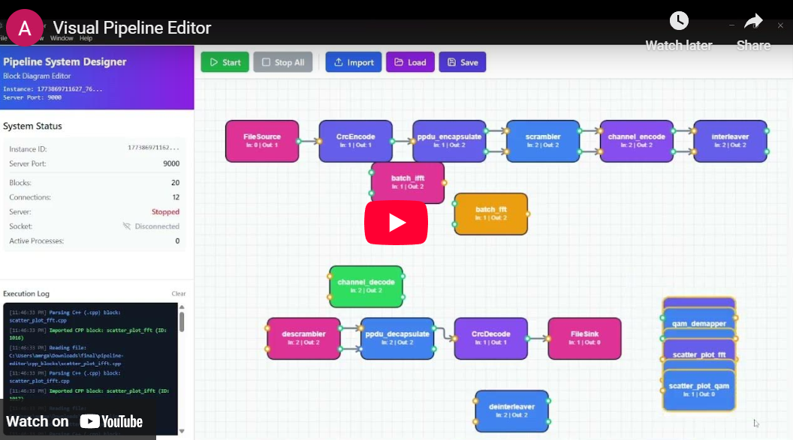
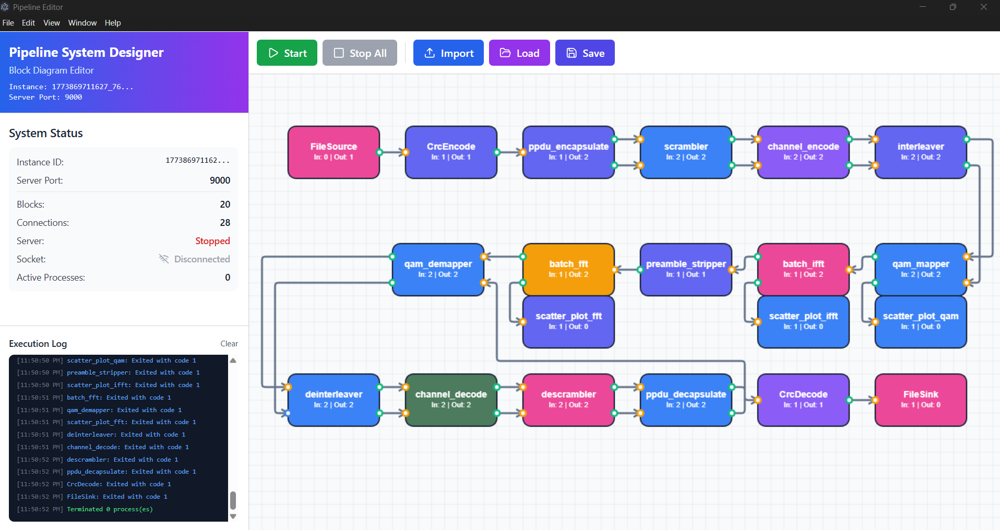

# Pipeline Editor 🔧⚡

A desktop application for designing, visualizing, and running multi-block signal processing pipelines. Built with Electron + React, it supports C++ and MATLAB processing blocks connected through a shared-memory pipe system, with Python support planned for the future.

[](https://www.youtube.com/embed/415SjxvwzUU?si=JoMYdqp_zO_AFvty)

## 📋 Description

Pipeline Editor provides a visual drag-and-drop interface for building dataflow pipelines where each block is an independent executable (C++ or MATLAB) that communicates with neighboring blocks through high-performance shared-memory pipes. The editor handles process orchestration, pipe creation, real-time throughput monitoring, and live scatter plot visualization — letting you focus on the signal processing logic rather than the plumbing.

## ✨ Features

- **Visual Block Diagram Editor**: Drag, connect, and arrange processing blocks on an interactive canvas
- **Multi-language Support**: C++ blocks today, MATLAB and Python blocks coming soon
- **Shared-Memory Pipes**: High-throughput inter-process communication with configurable packet and batch sizes
- **Real-Time Metrics**: Live Gbps throughput display per block streamed over TCP to the UI
- **Scatter Plot Visualization**: IQ constellation plots streamed directly from C++ blocks to the editor
- **Block Import**: Import C++ executables or MATLAB scripts as blocks with auto-detected pipe configurations
- **Multi-Select & Color Coding**: Select multiple blocks, group them visually, and assign colors for clarity
- **Pipeline Persistence**: Save and load pipeline diagrams

## 🖥️ Screenshots

### Home Screen


### Importing Blocks


### Sample OFDM Pipeline


### Block Color Customization


### Multi-Block Selection


## 🚀 Installation

1. **Clone the repository**
```bash
git clone https://github.com/TendoPain18/pipeline-editor.git
cd pipeline-editor
```

2. **Install dependencies**
```bash
npm install
```

3. **Start the application**
```bash
npm start
```

## 🔧 How It Works

Each block in the pipeline is an independent process (a compiled C++ executable or MATLAB script). The editor creates a named shared-memory region and a pair of Win32 events (`_Ready` / `_Empty`) for each pipe connection. Blocks read and write through these pipes using the `PipeIO` helper class, which handles synchronization automatically.

The editor communicates with running blocks over a local TCP socket. Each block connects on startup, sends `BLOCK_INIT` and `BLOCK_READY` events, and streams `BLOCK_METRICS` (frames processed, Gbps) at runtime. Scatter plot blocks stream IQ point batches as JSON over a separate TCP connection and the editor renders them live.

## 📦 Requirements

- Node.js 18+
- Windows OS (shared-memory pipes use Win32 APIs)
- Visual Studio / MSVC (for compiling C++ blocks)
- MATLAB (optional, for MATLAB blocks)

## 🌍 Language Support Roadmap

| Language | Status |
|----------|--------|
| C++ | ✅ Supported |
| MATLAB | ✅ Supported |
| Python | 🔜 Planned |

## 🤝 Contributing

Contributions are welcome! Feel free to open issues or pull requests for new features, bug fixes, or additional language support.

## 📄 License

This project is licensed under the MIT License - see the [LICENSE](LICENSE) file for details.

## 🙏 Acknowledgments

- Built with Electron, React, Vite, and Tailwind CSS
- IPC layer uses Win32 named shared memory and events
- Inspired by GNU Radio and similar dataflow frameworks

## <!-- CONTACT -->
<!-- END CONTACT -->

## **Build your signal processing pipelines visually! 🔧✨**
